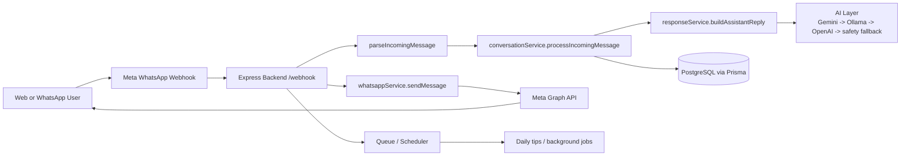

# Current System Architecture

This document reflects the current AFYAEDUCATORBOT runtime used in the repo today.

## High-Level Flow

## Core Components

- Web: `frontend/` evidence workspace and admin dashboard.
- Backend: `src/index.js`, `src/controllers/webhookController.js`, and `src/services/conversationService.js`.
- Queue / scheduler: `services/queueService.js` and `services/schedulerService.js`.
- AI stack: Gemini primary, Ollama local fallback, OpenAI fallback.
- Storage: PostgreSQL through Prisma.
- Analytics: admin stats, messages, emergencies, feedback, and log summaries.

## Webhook Entry Point

- `GET /webhook` verifies the Meta challenge.
- `POST /webhook` parses incoming WhatsApp payloads.
- Each message is processed once, with duplicate message IDs ignored.
- Replies are sent from the webhook controller, not from the legacy response service.

## Current Evidence Surface

- `GET /evidence` shows the checklist workspace for screenshots.
- `GET /admin/*` serves operational analytics behind JWT auth.
- `GET /api/chat/:phoneNumber` returns conversation history for review.
